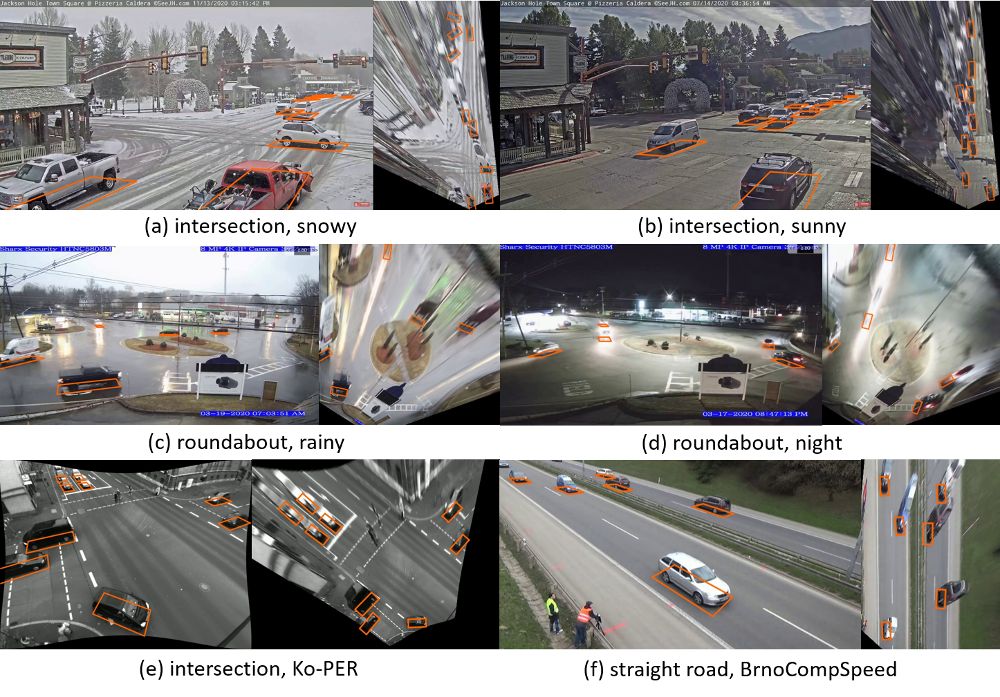

# Introduction

This directory contains the implementation for the paper [**Monocular 3D Vehicle Detection Using Uncalibrated Traffic Cameras through Homography**](https://arxiv.org/pdf/2103.15293.pdf). 
It includes code of the r-box detection network on BEV and the code for data synthesis of traffic camera images. They are organized as submodules. 
